# Diagramas técnicos del backend

Documentación derivada, regenerable desde el código. No es fuente de verdad: ante una diferencia
prevalecen [`specs/`](../../specs/) y el [contrato OpenAPI](../../specs/api/supplier-registration-openapi.yaml).
Sigue el formato del diagrama de secuencia de
[arquitectura §8](../../specs/architecture/architecture.md#8-diagrama-de-secuencia-guardar-datos-generales).

**Fuentes para regenerar:** controladores de `adapter.in.web`, servicios de `application.service`,
decoradores de `adapter.in.transaction`, ensamblaje de `configuration` (qué caso de uso lleva decorador) y
excepciones mapeadas en `GlobalExceptionHandler`. Generado el 2026-10-25.

## Convenciones

- Los mensajes expresan responsabilidades, no firmas Java exactas.
- **Autenticación.** Las operaciones protegidas pasan primero por el validador del token configurado en
  `SecurityConfiguration`. Valida firma, claims y contexto vigente del `jti` mediante `RegistrationContextPort`
  (ADR-0015). Un rechazo responde 401 `REGISTRATION_TOKEN_INVALID` sin invocar el controlador.
- **Transacción.** `Tx` es el decorador `Transactional*UseCase` que registra `configuration`. Abre la transacción
  antes del servicio y la confirma o revierte al terminar. Las consultas sin decorador no muestran `Tx`.
- **Errores.** Cada error de negocio es una excepción que `GlobalExceptionHandler` traduce a Problem Details
  (ADR-0019) con el HTTP y el `code` de ADR-0004. Un error con `Tx` revierte la transacción. Los fallos
  técnicos no mostrados responden 500 `INTERNAL_ERROR` (ADR-0007).
- **Propiedad del expediente.** `OwnedRegistration` resuelve la sesión del `jti`, recupera el expediente
  (con `FOR UPDATE` si modifica el agregado) y comprueba el RFC: 401, 404 y 403, en ese orden.

## 1. Componentes: adaptador → puerto → servicio

### 1.1. Puertos de entrada por controlador

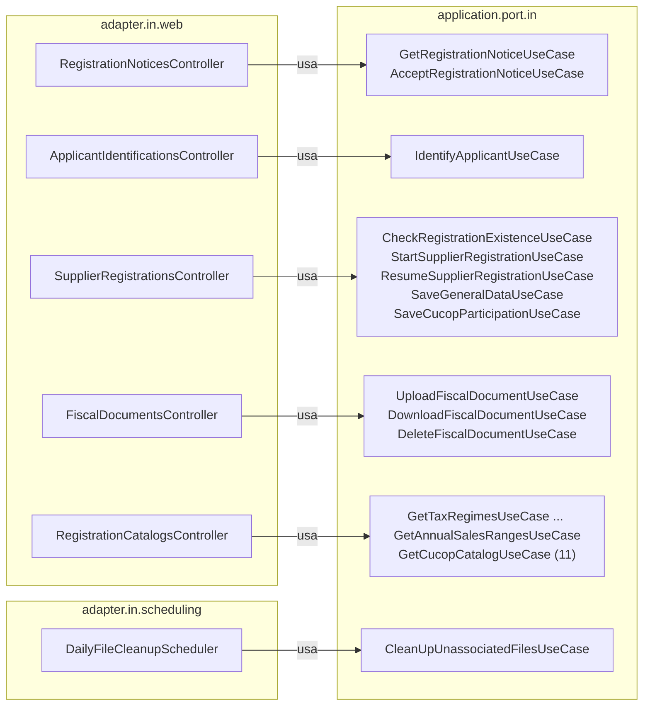
```mermaid
flowchart LR
    subgraph WEB["adapter.in.web"]
        NOTICES["RegistrationNoticesController"]
        IDENT["ApplicantIdentificationsController"]
        REGS["SupplierRegistrationsController"]
        DOCS["FiscalDocumentsController"]
        CATS["RegistrationCatalogsController"]
    end
    subgraph SCHED["adapter.in.scheduling"]
        CLEANER["DailyFileCleanupScheduler"]
    end
    subgraph IN["application.port.in"]
        NOTICE_UC["GetRegistrationNoticeUseCase<br/>AcceptRegistrationNoticeUseCase"]
        IDENT_UC["IdentifyApplicantUseCase"]
        REGS_UC["CheckRegistrationExistenceUseCase<br/>StartSupplierRegistrationUseCase<br/>ResumeSupplierRegistrationUseCase<br/>SaveGeneralDataUseCase<br/>SaveCucopParticipationUseCase"]
        DOCS_UC["UploadFiscalDocumentUseCase<br/>DownloadFiscalDocumentUseCase<br/>DeleteFiscalDocumentUseCase"]
        CATS_UC["GetTaxRegimesUseCase ... GetAnnualSalesRangesUseCase<br/>GetCucopCatalogUseCase (11)"]
        CLEAN_UC["CleanUpUnassociatedFilesUseCase"]
    end

    NOTICES -->|usa| NOTICE_UC
    IDENT -->|usa| IDENT_UC
    REGS -->|usa| REGS_UC
    DOCS -->|usa| DOCS_UC
    CATS -->|usa| CATS_UC
    CLEANER -->|usa| CLEAN_UC
```

### 1.2. Implementación de los puertos de entrada

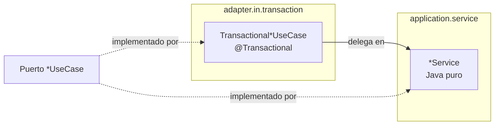
```mermaid
flowchart LR
    UC["Puerto *UseCase"]
    subgraph TX["adapter.in.transaction"]
        DECORATOR["Transactional*UseCase<br/>@Transactional"]
    end
    subgraph SVC["application.service"]
        SERVICE["*Service<br/>Java puro"]
    end

    UC -. implementado por .-> DECORATOR
    DECORATOR -->|delega en| SERVICE
    UC -. implementado por .-> SERVICE
```

| Caso de uso | Implementación registrada en `configuration` |
| :--- | :--- |
| `AcceptRegistrationNotice`, `IdentifyApplicant`, `StartSupplierRegistration`, `ResumeSupplierRegistration`, `SaveGeneralData`, `SaveCucopParticipation`, `UploadFiscalDocument`, `DownloadFiscalDocument`, `DeleteFiscalDocument`, `CleanUpUnassociatedFiles` | Decorador `Transactional*UseCase` que envuelve su `*Service`. |
| `GetRegistrationNotice`, `CheckRegistrationExistence` y los 11 catálogos | `*Service` directo, sin decorador. |

### 1.3. Puertos de salida y adaptadores

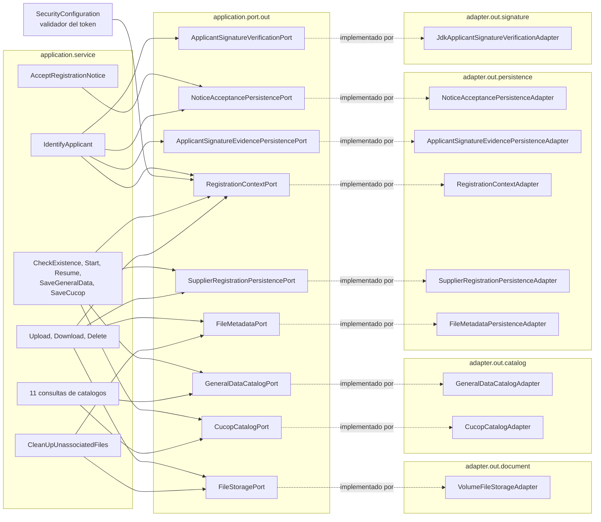
```mermaid
flowchart LR
    subgraph SVC["application.service"]
        NOTICE_S["AcceptRegistrationNotice"]
        IDENT_S["IdentifyApplicant"]
        REG_S["CheckExistence, Start, Resume,<br/>SaveGeneralData, SaveCucop"]
        DOC_S["Upload, Download, Delete"]
        CAT_S["11 consultas de catalogos"]
        CLEAN_S["CleanUpUnassociatedFiles"]
    end
    SEC["SecurityConfiguration<br/>validador del token"]
    subgraph OUT["application.port.out"]
        ACC_P["NoticeAcceptancePersistencePort"]
        VER_P["ApplicantSignatureVerificationPort"]
        EVI_P["ApplicantSignatureEvidencePersistencePort"]
        CTX_P["RegistrationContextPort"]
        REG_P["SupplierRegistrationPersistencePort"]
        GDC_P["GeneralDataCatalogPort"]
        CUC_P["CucopCatalogPort"]
        META_P["FileMetadataPort"]
        STO_P["FileStoragePort"]
    end
    subgraph PERSIST["adapter.out.persistence"]
        ACC_A["NoticeAcceptancePersistenceAdapter"]
        EVI_A["ApplicantSignatureEvidencePersistenceAdapter"]
        CTX_A["RegistrationContextAdapter"]
        REG_A["SupplierRegistrationPersistenceAdapter"]
        META_A["FileMetadataPersistenceAdapter"]
    end
    subgraph SIGN["adapter.out.signature"]
        VER_A["JdkApplicantSignatureVerificationAdapter"]
    end
    subgraph CATALOG["adapter.out.catalog"]
        GDC_A["GeneralDataCatalogAdapter"]
        CUC_A["CucopCatalogAdapter"]
    end
    subgraph DOCUMENT["adapter.out.document"]
        STO_A["VolumeFileStorageAdapter"]
    end

    NOTICE_S --> ACC_P
    IDENT_S --> ACC_P
    IDENT_S --> VER_P
    IDENT_S --> EVI_P
    IDENT_S --> CTX_P
    SEC --> CTX_P
    REG_S --> CTX_P
    REG_S --> REG_P
    REG_S --> GDC_P
    REG_S --> CUC_P
    DOC_S --> CTX_P
    DOC_S --> REG_P
    DOC_S --> META_P
    DOC_S --> STO_P
    CAT_S --> GDC_P
    CAT_S --> CUC_P
    CLEAN_S --> META_P
    CLEAN_S --> STO_P

    ACC_P -. implementado por .-> ACC_A
    EVI_P -. implementado por .-> EVI_A
    CTX_P -. implementado por .-> CTX_A
    REG_P -. implementado por .-> REG_A
    META_P -. implementado por .-> META_A
    VER_P -. implementado por .-> VER_A
    GDC_P -. implementado por .-> GDC_A
    CUC_P -. implementado por .-> CUC_A
    STO_P -. implementado por .-> STO_A
```

## 2. RegistrationNotices

### 2.1. `getRegistrationNotice`

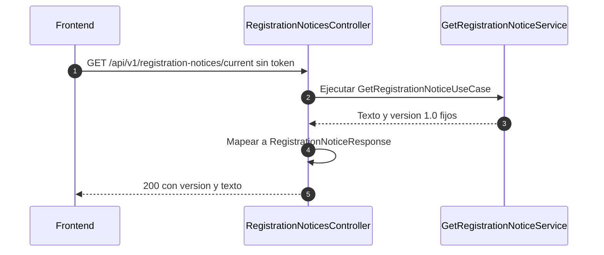
```mermaid
sequenceDiagram
    autonumber
    participant Frontend
    participant Web as RegistrationNoticesController
    participant Service as GetRegistrationNoticeService

    Frontend->>Web: GET /api/v1/registration-notices/current sin token
    Web->>Service: Ejecutar GetRegistrationNoticeUseCase
    Service-->>Web: Texto y version 1.0 fijos
    Web->>Web: Mapear a RegistrationNoticeResponse
    Web-->>Frontend: 200 con version y texto
```

### 2.2. `acceptRegistrationNotice`

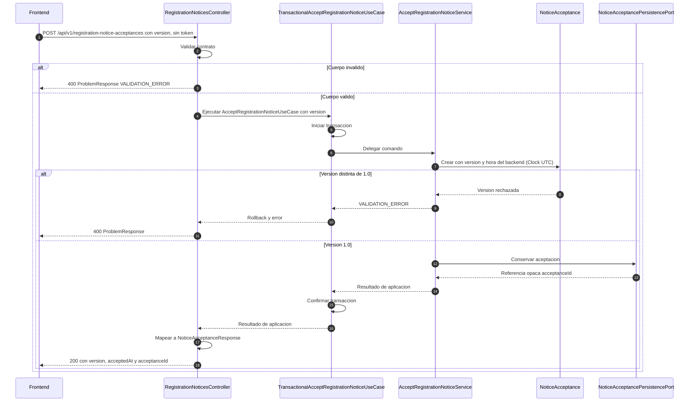
```mermaid
sequenceDiagram
    autonumber
    participant Frontend
    participant Web as RegistrationNoticesController
    participant Tx as TransactionalAcceptRegistrationNoticeUseCase
    participant Service as AcceptRegistrationNoticeService
    participant Acceptance as NoticeAcceptance
    participant Acceptances as NoticeAcceptancePersistencePort

    Frontend->>Web: POST /api/v1/registration-notice-acceptances con version, sin token
    Web->>Web: Validar contrato
    alt Cuerpo invalido
        Web-->>Frontend: 400 ProblemResponse VALIDATION_ERROR
    else Cuerpo valido
        Web->>Tx: Ejecutar AcceptRegistrationNoticeUseCase con version
        Tx->>Tx: Iniciar transaccion
        Tx->>Service: Delegar comando
        Service->>Acceptance: Crear con version y hora del backend (Clock UTC)
        alt Version distinta de 1.0
            Acceptance-->>Service: Version rechazada
            Service-->>Tx: VALIDATION_ERROR
            Tx-->>Web: Rollback y error
            Web-->>Frontend: 400 ProblemResponse
        else Version 1.0
            Service->>Acceptances: Conservar aceptacion
            Acceptances-->>Service: Referencia opaca acceptanceId
            Service-->>Tx: Resultado de aplicacion
            Tx->>Tx: Confirmar transaccion
            Tx-->>Web: Resultado de aplicacion
            Web->>Web: Mapear a NoticeAcceptanceResponse
            Web-->>Frontend: 200 con version, acceptedAt y acceptanceId
        end
    end
```

## 3. ApplicantIdentifications

### 3.1. `identifyApplicant`

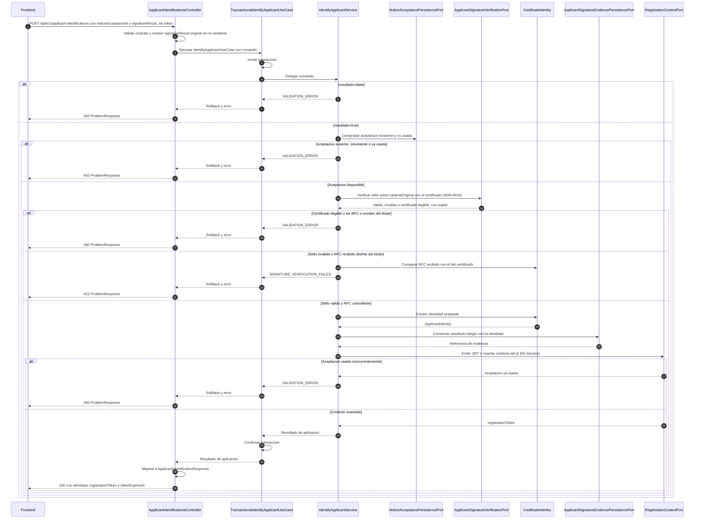
```mermaid
sequenceDiagram
    autonumber
    participant Frontend
    participant Web as ApplicantIdentificationsController
    participant Tx as TransactionalIdentifyApplicantUseCase
    participant Service as IdentifyApplicantService
    participant Acceptances as NoticeAcceptancePersistencePort
    participant Signature as ApplicantSignatureVerificationPort
    participant Identity as CertificateIdentity
    participant Evidence as ApplicantSignatureEvidencePersistencePort
    participant Context as RegistrationContextPort

    Frontend->>Web: POST /api/v1/applicant-identifications con noticeAcceptanceId y signatureResult, sin token
    Web->>Web: Validar contrato y extraer signatureResult original sin re-serializar
    Web->>Tx: Ejecutar IdentifyApplicantUseCase con comando
    Tx->>Tx: Iniciar transaccion
    Tx->>Service: Delegar comando
    alt resultado=false
        Service-->>Tx: VALIDATION_ERROR
        Tx-->>Web: Rollback y error
        Web-->>Frontend: 400 ProblemResponse
    else resultado=true
        Service->>Acceptances: Comprobar aceptacion existente y no usada
        alt Aceptacion ausente, inexistente o ya usada
            Service-->>Tx: VALIDATION_ERROR
            Tx-->>Web: Rollback y error
            Web-->>Frontend: 400 ProblemResponse
        else Aceptacion disponible
            Service->>Signature: Verificar sello sobre cadenaOriginal con el certificado (ADR-0016)
            Signature-->>Service: Valido, invalido o certificado ilegible, con sujeto
            alt Certificado ilegible o sin RFC o nombre del titular
                Service-->>Tx: VALIDATION_ERROR
                Tx-->>Web: Rollback y error
                Web-->>Frontend: 400 ProblemResponse
            else Sello invalido o RFC recibido distinto del titular
                Service->>Identity: Comparar RFC recibido con el del certificado
                Service-->>Tx: SIGNATURE_VERIFICATION_FAILED
                Tx-->>Web: Rollback y error
                Web-->>Frontend: 422 ProblemResponse
            else Sello valido y RFC coincidente
                Service->>Identity: Extraer identidad aceptada
                Identity-->>Service: ApplicantIdentity
                Service->>Evidence: Conservar resultado integro con la identidad
                Evidence-->>Service: Referencia de evidencia
                Service->>Context: Emitir JWT e insertar contexto del jti (60 minutos)
                alt Aceptacion usada concurrentemente
                    Context-->>Service: Aceptacion ya usada
                    Service-->>Tx: VALIDATION_ERROR
                    Tx-->>Web: Rollback y error
                    Web-->>Frontend: 400 ProblemResponse
                else Contexto insertado
                    Context-->>Service: registrationToken
                    Service-->>Tx: Resultado de aplicacion
                    Tx->>Tx: Confirmar transaccion
                    Tx-->>Web: Resultado de aplicacion
                    Web->>Web: Mapear a ApplicantIdentificationResponse
                    Web-->>Frontend: 200 con identidad, registrationToken y tokenExpiresAt
                end
            end
        end
    end
```

## 4. SupplierRegistrations

### 4.1. `checkRegistrationExistence`

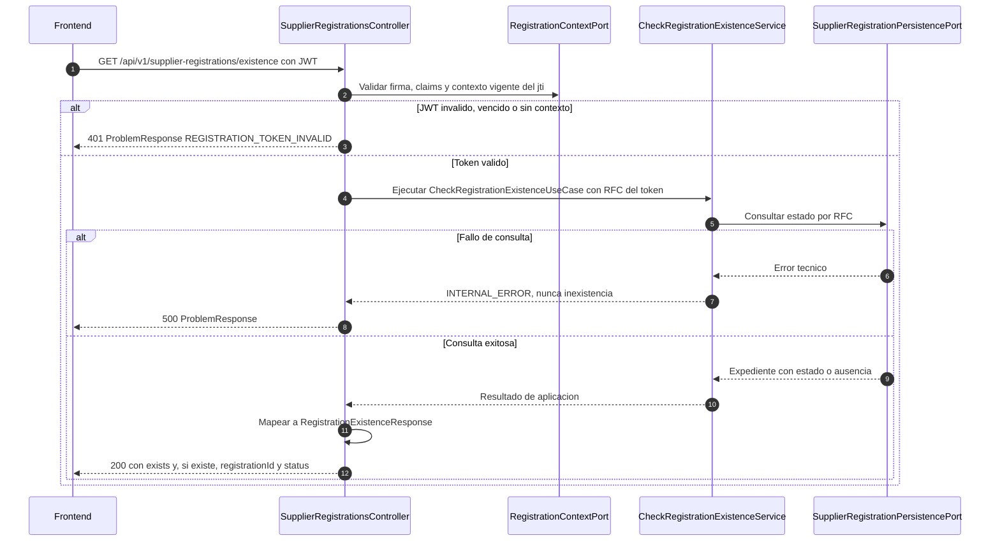
```mermaid
sequenceDiagram
    autonumber
    participant Frontend
    participant Web as SupplierRegistrationsController
    participant Context as RegistrationContextPort
    participant Service as CheckRegistrationExistenceService
    participant Persistence as SupplierRegistrationPersistencePort

    Frontend->>Web: GET /api/v1/supplier-registrations/existence con JWT
    Web->>Context: Validar firma, claims y contexto vigente del jti
    alt JWT invalido, vencido o sin contexto
        Web-->>Frontend: 401 ProblemResponse REGISTRATION_TOKEN_INVALID
    else Token valido
        Web->>Service: Ejecutar CheckRegistrationExistenceUseCase con RFC del token
        Service->>Persistence: Consultar estado por RFC
        alt Fallo de consulta
            Persistence-->>Service: Error tecnico
            Service-->>Web: INTERNAL_ERROR, nunca inexistencia
            Web-->>Frontend: 500 ProblemResponse
        else Consulta exitosa
            Persistence-->>Service: Expediente con estado o ausencia
            Service-->>Web: Resultado de aplicacion
            Web->>Web: Mapear a RegistrationExistenceResponse
            Web-->>Frontend: 200 con exists y, si existe, registrationId y status
        end
    end
```

### 4.2. `startSupplierRegistration`

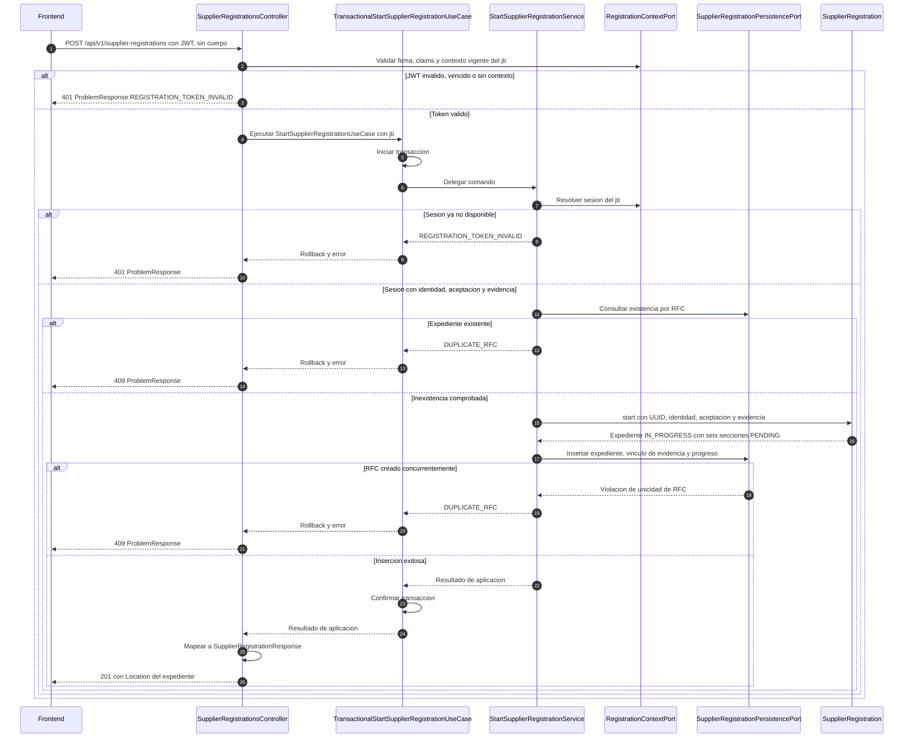
```mermaid
sequenceDiagram
    autonumber
    participant Frontend
    participant Web as SupplierRegistrationsController
    participant Tx as TransactionalStartSupplierRegistrationUseCase
    participant Service as StartSupplierRegistrationService
    participant Context as RegistrationContextPort
    participant Persistence as SupplierRegistrationPersistencePort
    participant Registration as SupplierRegistration

    Frontend->>Web: POST /api/v1/supplier-registrations con JWT, sin cuerpo
    Web->>Context: Validar firma, claims y contexto vigente del jti
    alt JWT invalido, vencido o sin contexto
        Web-->>Frontend: 401 ProblemResponse REGISTRATION_TOKEN_INVALID
    else Token valido
        Web->>Tx: Ejecutar StartSupplierRegistrationUseCase con jti
        Tx->>Tx: Iniciar transaccion
        Tx->>Service: Delegar comando
        Service->>Context: Resolver sesion del jti
        alt Sesion ya no disponible
            Service-->>Tx: REGISTRATION_TOKEN_INVALID
            Tx-->>Web: Rollback y error
            Web-->>Frontend: 401 ProblemResponse
        else Sesion con identidad, aceptacion y evidencia
            Service->>Persistence: Consultar existencia por RFC
            alt Expediente existente
                Service-->>Tx: DUPLICATE_RFC
                Tx-->>Web: Rollback y error
                Web-->>Frontend: 409 ProblemResponse
            else Inexistencia comprobada
                Service->>Registration: start con UUID, identidad, aceptacion y evidencia
                Registration-->>Service: Expediente IN_PROGRESS con seis secciones PENDING
                Service->>Persistence: Insertar expediente, vinculo de evidencia y progreso
                alt RFC creado concurrentemente
                    Persistence-->>Service: Violacion de unicidad de RFC
                    Service-->>Tx: DUPLICATE_RFC
                    Tx-->>Web: Rollback y error
                    Web-->>Frontend: 409 ProblemResponse
                else Insercion exitosa
                    Service-->>Tx: Resultado de aplicacion
                    Tx->>Tx: Confirmar transaccion
                    Tx-->>Web: Resultado de aplicacion
                    Web->>Web: Mapear a SupplierRegistrationResponse
                    Web-->>Frontend: 201 con Location del expediente
                end
            end
        end
    end
```

### 4.3. `resumeSupplierRegistration`

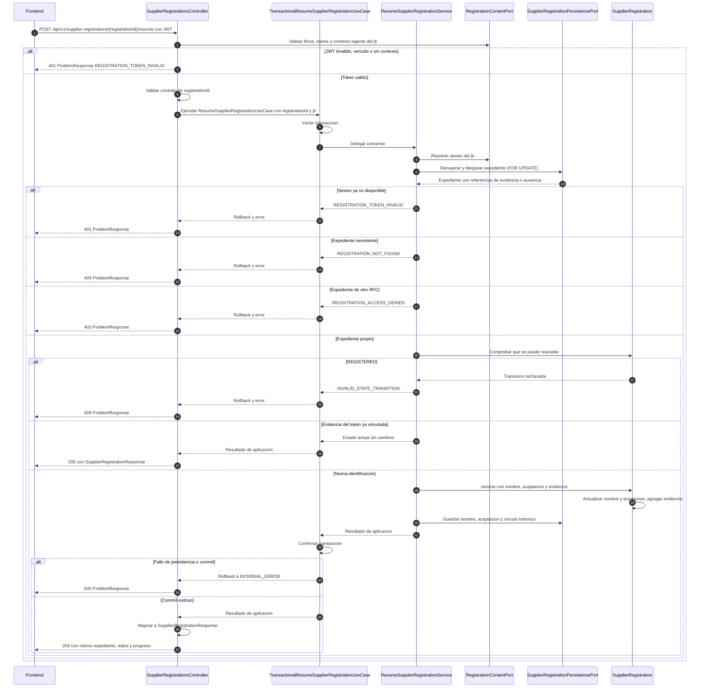
```mermaid
sequenceDiagram
    autonumber
    participant Frontend
    participant Web as SupplierRegistrationsController
    participant Tx as TransactionalResumeSupplierRegistrationUseCase
    participant Service as ResumeSupplierRegistrationService
    participant Context as RegistrationContextPort
    participant Persistence as SupplierRegistrationPersistencePort
    participant Registration as SupplierRegistration

    Frontend->>Web: POST /api/v1/supplier-registrations/{registrationId}/resume con JWT
    Web->>Context: Validar firma, claims y contexto vigente del jti
    alt JWT invalido, vencido o sin contexto
        Web-->>Frontend: 401 ProblemResponse REGISTRATION_TOKEN_INVALID
    else Token valido
        Web->>Web: Validar contrato de registrationId
        Web->>Tx: Ejecutar ResumeSupplierRegistrationUseCase con registrationId y jti
        Tx->>Tx: Iniciar transaccion
        Tx->>Service: Delegar comando
        Service->>Context: Resolver sesion del jti
        Service->>Persistence: Recuperar y bloquear expediente (FOR UPDATE)
        Persistence-->>Service: Expediente con referencias de evidencia o ausencia
        alt Sesion ya no disponible
            Service-->>Tx: REGISTRATION_TOKEN_INVALID
            Tx-->>Web: Rollback y error
            Web-->>Frontend: 401 ProblemResponse
        else Expediente inexistente
            Service-->>Tx: REGISTRATION_NOT_FOUND
            Tx-->>Web: Rollback y error
            Web-->>Frontend: 404 ProblemResponse
        else Expediente de otro RFC
            Service-->>Tx: REGISTRATION_ACCESS_DENIED
            Tx-->>Web: Rollback y error
            Web-->>Frontend: 403 ProblemResponse
        else Expediente propio
            Service->>Registration: Comprobar que se puede reanudar
            alt REGISTERED
                Registration-->>Service: Transicion rechazada
                Service-->>Tx: INVALID_STATE_TRANSITION
                Tx-->>Web: Rollback y error
                Web-->>Frontend: 409 ProblemResponse
            else Evidencia del token ya vinculada
                Service-->>Tx: Estado actual sin cambios
                Tx-->>Web: Resultado de aplicacion
                Web-->>Frontend: 200 con SupplierRegistrationResponse
            else Nueva identificacion
                Service->>Registration: resume con nombre, aceptacion y evidencia
                Registration->>Registration: Actualizar nombre y aceptacion, agregar evidencia
                Service->>Persistence: Guardar nombre, aceptacion y vinculo historico
                Service-->>Tx: Resultado de aplicacion
                Tx->>Tx: Confirmar transaccion
                alt Fallo de persistencia o commit
                    Tx-->>Web: Rollback e INTERNAL_ERROR
                    Web-->>Frontend: 500 ProblemResponse
                else Commit exitoso
                    Tx-->>Web: Resultado de aplicacion
                    Web->>Web: Mapear a SupplierRegistrationResponse
                    Web-->>Frontend: 200 con mismo expediente, datos y progreso
                end
            end
        end
    end
```

### 4.4. `saveGeneralData`

Idéntico al diagrama de [arquitectura §8](../../specs/architecture/architecture.md#8-diagrama-de-secuencia-guardar-datos-generales),
que es la referencia normativa de este formato.

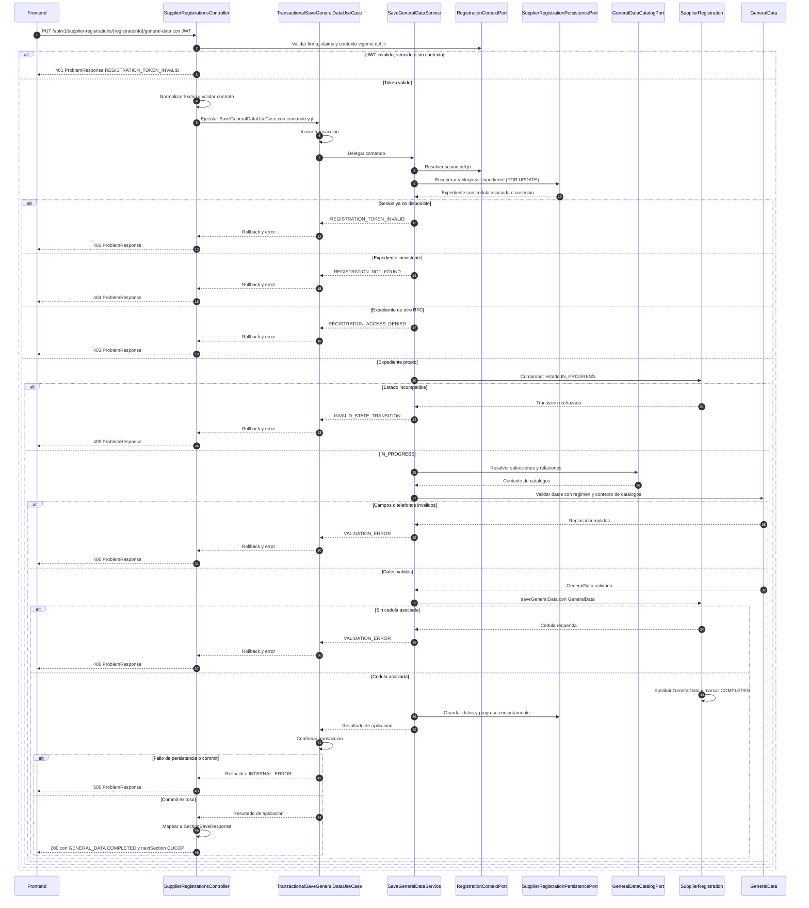
```mermaid
sequenceDiagram
    autonumber
    participant Frontend
    participant Web as SupplierRegistrationsController
    participant Tx as TransactionalSaveGeneralDataUseCase
    participant Service as SaveGeneralDataService
    participant Context as RegistrationContextPort
    participant Persistence as SupplierRegistrationPersistencePort
    participant Catalogs as GeneralDataCatalogPort
    participant Registration as SupplierRegistration
    participant Data as GeneralData

    Frontend->>Web: PUT /api/v1/supplier-registrations/{registrationId}/general-data con JWT
    Web->>Context: Validar firma, claims y contexto vigente del jti
    alt JWT invalido, vencido o sin contexto
        Web-->>Frontend: 401 ProblemResponse REGISTRATION_TOKEN_INVALID
    else Token valido
        Web->>Web: Normalizar textos y validar contrato
        Web->>Tx: Ejecutar SaveGeneralDataUseCase con comando y jti
        Tx->>Tx: Iniciar transaccion
        Tx->>Service: Delegar comando
        Service->>Context: Resolver sesion del jti
        Service->>Persistence: Recuperar y bloquear expediente (FOR UPDATE)
        Persistence-->>Service: Expediente con cedula asociada o ausencia
        alt Sesion ya no disponible
            Service-->>Tx: REGISTRATION_TOKEN_INVALID
            Tx-->>Web: Rollback y error
            Web-->>Frontend: 401 ProblemResponse
        else Expediente inexistente
            Service-->>Tx: REGISTRATION_NOT_FOUND
            Tx-->>Web: Rollback y error
            Web-->>Frontend: 404 ProblemResponse
        else Expediente de otro RFC
            Service-->>Tx: REGISTRATION_ACCESS_DENIED
            Tx-->>Web: Rollback y error
            Web-->>Frontend: 403 ProblemResponse
        else Expediente propio
            Service->>Registration: Comprobar estado IN_PROGRESS
            alt Estado incompatible
                Registration-->>Service: Transicion rechazada
                Service-->>Tx: INVALID_STATE_TRANSITION
                Tx-->>Web: Rollback y error
                Web-->>Frontend: 409 ProblemResponse
            else IN_PROGRESS
                Service->>Catalogs: Resolver selecciones y relaciones
                Catalogs-->>Service: Contexto de catalogos
                Service->>Data: Validar datos con regimen y contexto de catalogos
                alt Campos o telefonos invalidos
                    Data-->>Service: Reglas incumplidas
                    Service-->>Tx: VALIDATION_ERROR
                    Tx-->>Web: Rollback y error
                    Web-->>Frontend: 400 ProblemResponse
                else Datos validos
                    Data-->>Service: GeneralData validado
                    Service->>Registration: saveGeneralData con GeneralData
                    alt Sin cedula asociada
                        Registration-->>Service: Cedula requerida
                        Service-->>Tx: VALIDATION_ERROR
                        Tx-->>Web: Rollback y error
                        Web-->>Frontend: 400 ProblemResponse
                    else Cedula asociada
                        Registration->>Registration: Sustituir GeneralData y marcar COMPLETED
                        Service->>Persistence: Guardar datos y progreso conjuntamente
                        Service-->>Tx: Resultado de aplicacion
                        Tx->>Tx: Confirmar transaccion
                        alt Fallo de persistencia o commit
                            Tx-->>Web: Rollback e INTERNAL_ERROR
                            Web-->>Frontend: 500 ProblemResponse
                        else Commit exitoso
                            Tx-->>Web: Resultado de aplicacion
                            Web->>Web: Mapear a SectionSaveResponse
                            Web-->>Frontend: 200 con GENERAL_DATA COMPLETED y nextSection CUCOP
                        end
                    end
                end
            end
        end
    end
```

### 4.5. `saveCucopParticipation`

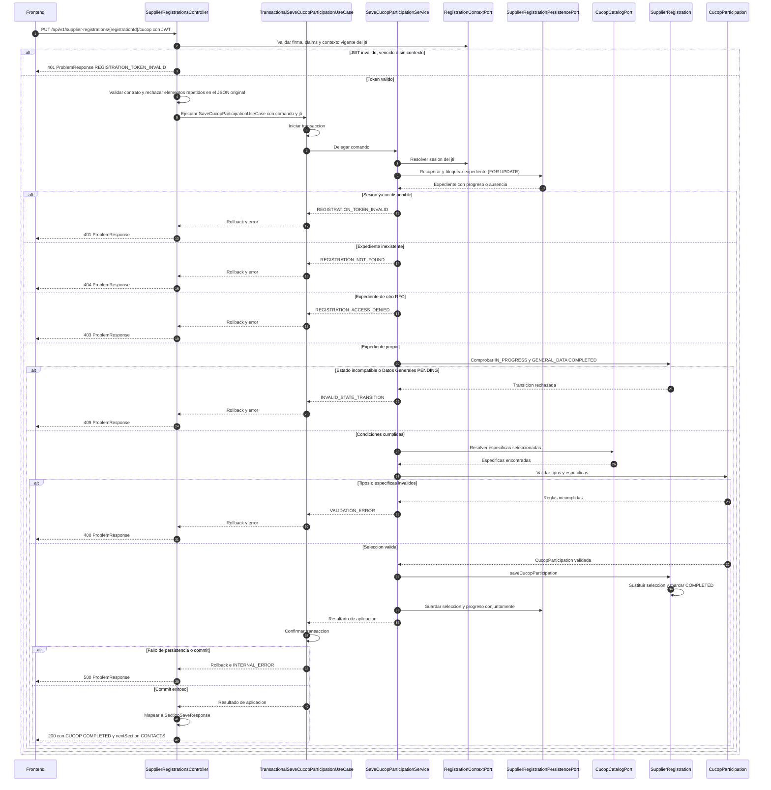
```mermaid
sequenceDiagram
    autonumber
    participant Frontend
    participant Web as SupplierRegistrationsController
    participant Tx as TransactionalSaveCucopParticipationUseCase
    participant Service as SaveCucopParticipationService
    participant Context as RegistrationContextPort
    participant Persistence as SupplierRegistrationPersistencePort
    participant Catalog as CucopCatalogPort
    participant Registration as SupplierRegistration
    participant Participation as CucopParticipation

    Frontend->>Web: PUT /api/v1/supplier-registrations/{registrationId}/cucop con JWT
    Web->>Context: Validar firma, claims y contexto vigente del jti
    alt JWT invalido, vencido o sin contexto
        Web-->>Frontend: 401 ProblemResponse REGISTRATION_TOKEN_INVALID
    else Token valido
        Web->>Web: Validar contrato y rechazar elementos repetidos en el JSON original
        Web->>Tx: Ejecutar SaveCucopParticipationUseCase con comando y jti
        Tx->>Tx: Iniciar transaccion
        Tx->>Service: Delegar comando
        Service->>Context: Resolver sesion del jti
        Service->>Persistence: Recuperar y bloquear expediente (FOR UPDATE)
        Persistence-->>Service: Expediente con progreso o ausencia
        alt Sesion ya no disponible
            Service-->>Tx: REGISTRATION_TOKEN_INVALID
            Tx-->>Web: Rollback y error
            Web-->>Frontend: 401 ProblemResponse
        else Expediente inexistente
            Service-->>Tx: REGISTRATION_NOT_FOUND
            Tx-->>Web: Rollback y error
            Web-->>Frontend: 404 ProblemResponse
        else Expediente de otro RFC
            Service-->>Tx: REGISTRATION_ACCESS_DENIED
            Tx-->>Web: Rollback y error
            Web-->>Frontend: 403 ProblemResponse
        else Expediente propio
            Service->>Registration: Comprobar IN_PROGRESS y GENERAL_DATA COMPLETED
            alt Estado incompatible o Datos Generales PENDING
                Registration-->>Service: Transicion rechazada
                Service-->>Tx: INVALID_STATE_TRANSITION
                Tx-->>Web: Rollback y error
                Web-->>Frontend: 409 ProblemResponse
            else Condiciones cumplidas
                Service->>Catalog: Resolver especificas seleccionadas
                Catalog-->>Service: Especificas encontradas
                Service->>Participation: Validar tipos y especificas
                alt Tipos o especificas invalidos
                    Participation-->>Service: Reglas incumplidas
                    Service-->>Tx: VALIDATION_ERROR
                    Tx-->>Web: Rollback y error
                    Web-->>Frontend: 400 ProblemResponse
                else Seleccion valida
                    Participation-->>Service: CucopParticipation validada
                    Service->>Registration: saveCucopParticipation
                    Registration->>Registration: Sustituir seleccion y marcar COMPLETED
                    Service->>Persistence: Guardar seleccion y progreso conjuntamente
                    Service-->>Tx: Resultado de aplicacion
                    Tx->>Tx: Confirmar transaccion
                    alt Fallo de persistencia o commit
                        Tx-->>Web: Rollback e INTERNAL_ERROR
                        Web-->>Frontend: 500 ProblemResponse
                    else Commit exitoso
                        Tx-->>Web: Resultado de aplicacion
                        Web->>Web: Mapear a SectionSaveResponse
                        Web-->>Frontend: 200 con CUCOP COMPLETED y nextSection CONTACTS
                    end
                end
            end
        end
    end
```

## 5. FiscalDocuments

### 5.1. `uploadFiscalDocument`

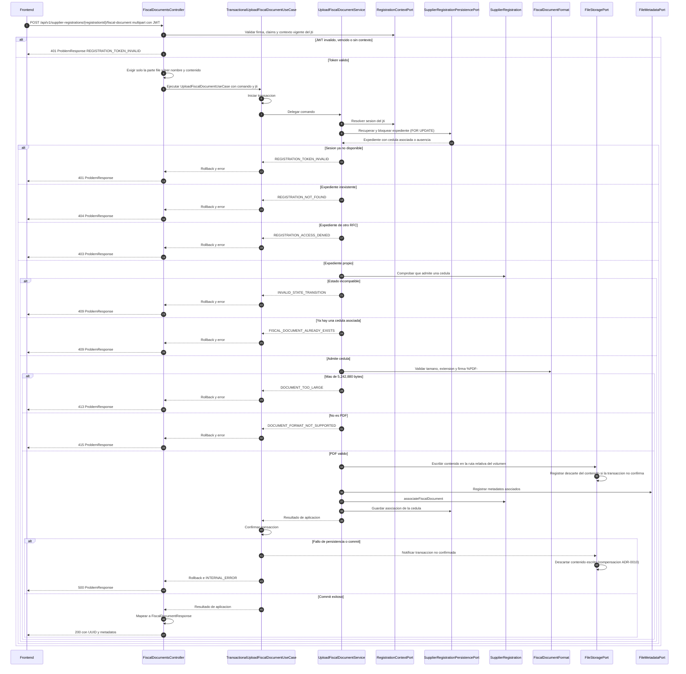
```mermaid
sequenceDiagram
    autonumber
    participant Frontend
    participant Web as FiscalDocumentsController
    participant Tx as TransactionalUploadFiscalDocumentUseCase
    participant Service as UploadFiscalDocumentService
    participant Context as RegistrationContextPort
    participant Persistence as SupplierRegistrationPersistencePort
    participant Registration as SupplierRegistration
    participant Format as FiscalDocumentFormat
    participant Storage as FileStoragePort
    participant Metadata as FileMetadataPort

    Frontend->>Web: POST /api/v1/supplier-registrations/{registrationId}/fiscal-document multipart con JWT
    Web->>Context: Validar firma, claims y contexto vigente del jti
    alt JWT invalido, vencido o sin contexto
        Web-->>Frontend: 401 ProblemResponse REGISTRATION_TOKEN_INVALID
    else Token valido
        Web->>Web: Exigir solo la parte file y leer nombre y contenido
        Web->>Tx: Ejecutar UploadFiscalDocumentUseCase con comando y jti
        Tx->>Tx: Iniciar transaccion
        Tx->>Service: Delegar comando
        Service->>Context: Resolver sesion del jti
        Service->>Persistence: Recuperar y bloquear expediente (FOR UPDATE)
        Persistence-->>Service: Expediente con cedula asociada o ausencia
        alt Sesion ya no disponible
            Service-->>Tx: REGISTRATION_TOKEN_INVALID
            Tx-->>Web: Rollback y error
            Web-->>Frontend: 401 ProblemResponse
        else Expediente inexistente
            Service-->>Tx: REGISTRATION_NOT_FOUND
            Tx-->>Web: Rollback y error
            Web-->>Frontend: 404 ProblemResponse
        else Expediente de otro RFC
            Service-->>Tx: REGISTRATION_ACCESS_DENIED
            Tx-->>Web: Rollback y error
            Web-->>Frontend: 403 ProblemResponse
        else Expediente propio
            Service->>Registration: Comprobar que admite una cedula
            alt Estado incompatible
                Service-->>Tx: INVALID_STATE_TRANSITION
                Tx-->>Web: Rollback y error
                Web-->>Frontend: 409 ProblemResponse
            else Ya hay una cedula asociada
                Service-->>Tx: FISCAL_DOCUMENT_ALREADY_EXISTS
                Tx-->>Web: Rollback y error
                Web-->>Frontend: 409 ProblemResponse
            else Admite cedula
                Service->>Format: Validar tamano, extension y firma %PDF-
                alt Mas de 5,242,880 bytes
                    Service-->>Tx: DOCUMENT_TOO_LARGE
                    Tx-->>Web: Rollback y error
                    Web-->>Frontend: 413 ProblemResponse
                else No es PDF
                    Service-->>Tx: DOCUMENT_FORMAT_NOT_SUPPORTED
                    Tx-->>Web: Rollback y error
                    Web-->>Frontend: 415 ProblemResponse
                else PDF valido
                    Service->>Storage: Escribir contenido en la ruta relativa del volumen
                    Storage->>Storage: Registrar descarte del contenido si la transaccion no confirma
                    Service->>Metadata: Registrar metadatos asociados
                    Service->>Registration: associateFiscalDocument
                    Service->>Persistence: Guardar asociacion de la cedula
                    Service-->>Tx: Resultado de aplicacion
                    Tx->>Tx: Confirmar transaccion
                    alt Fallo de persistencia o commit
                        Tx-->>Storage: Notificar transaccion no confirmada
                        Storage->>Storage: Descartar contenido escrito (compensacion ADR-0010)
                        Tx-->>Web: Rollback e INTERNAL_ERROR
                        Web-->>Frontend: 500 ProblemResponse
                    else Commit exitoso
                        Tx-->>Web: Resultado de aplicacion
                        Web->>Web: Mapear a FiscalDocumentResponse
                        Web-->>Frontend: 200 con UUID y metadatos
                    end
                end
            end
        end
    end
```

### 5.2. `downloadFiscalDocument`

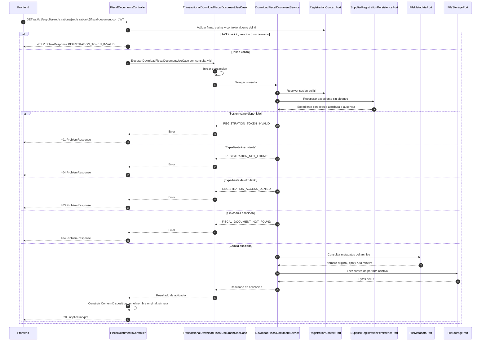
```mermaid
sequenceDiagram
    autonumber
    participant Frontend
    participant Web as FiscalDocumentsController
    participant Tx as TransactionalDownloadFiscalDocumentUseCase
    participant Service as DownloadFiscalDocumentService
    participant Context as RegistrationContextPort
    participant Persistence as SupplierRegistrationPersistencePort
    participant Metadata as FileMetadataPort
    participant Storage as FileStoragePort

    Frontend->>Web: GET /api/v1/supplier-registrations/{registrationId}/fiscal-document con JWT
    Web->>Context: Validar firma, claims y contexto vigente del jti
    alt JWT invalido, vencido o sin contexto
        Web-->>Frontend: 401 ProblemResponse REGISTRATION_TOKEN_INVALID
    else Token valido
        Web->>Tx: Ejecutar DownloadFiscalDocumentUseCase con consulta y jti
        Tx->>Tx: Iniciar transaccion
        Tx->>Service: Delegar consulta
        Service->>Context: Resolver sesion del jti
        Service->>Persistence: Recuperar expediente sin bloqueo
        Persistence-->>Service: Expediente con cedula asociada o ausencia
        alt Sesion ya no disponible
            Service-->>Tx: REGISTRATION_TOKEN_INVALID
            Tx-->>Web: Error
            Web-->>Frontend: 401 ProblemResponse
        else Expediente inexistente
            Service-->>Tx: REGISTRATION_NOT_FOUND
            Tx-->>Web: Error
            Web-->>Frontend: 404 ProblemResponse
        else Expediente de otro RFC
            Service-->>Tx: REGISTRATION_ACCESS_DENIED
            Tx-->>Web: Error
            Web-->>Frontend: 403 ProblemResponse
        else Sin cedula asociada
            Service-->>Tx: FISCAL_DOCUMENT_NOT_FOUND
            Tx-->>Web: Error
            Web-->>Frontend: 404 ProblemResponse
        else Cedula asociada
            Service->>Metadata: Consultar metadatos del archivo
            Metadata-->>Service: Nombre original, tipo y ruta relativa
            Service->>Storage: Leer contenido por ruta relativa
            Storage-->>Service: Bytes del PDF
            Service-->>Tx: Resultado de aplicacion
            Tx-->>Web: Resultado de aplicacion
            Web->>Web: Construir Content-Disposition con el nombre original, sin ruta
            Web-->>Frontend: 200 application/pdf
        end
    end
```

### 5.3. `deleteFiscalDocument`

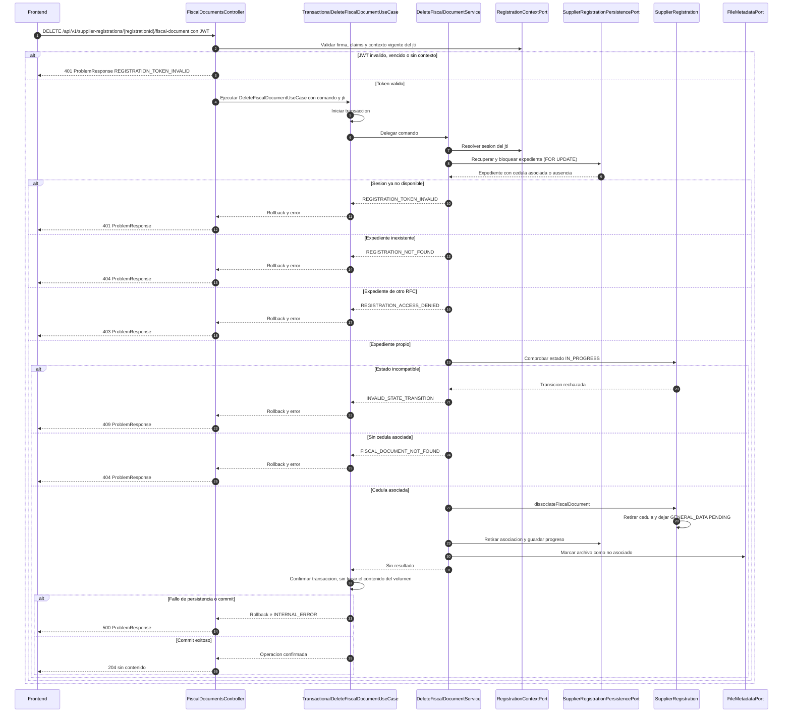
```mermaid
sequenceDiagram
    autonumber
    participant Frontend
    participant Web as FiscalDocumentsController
    participant Tx as TransactionalDeleteFiscalDocumentUseCase
    participant Service as DeleteFiscalDocumentService
    participant Context as RegistrationContextPort
    participant Persistence as SupplierRegistrationPersistencePort
    participant Registration as SupplierRegistration
    participant Metadata as FileMetadataPort

    Frontend->>Web: DELETE /api/v1/supplier-registrations/{registrationId}/fiscal-document con JWT
    Web->>Context: Validar firma, claims y contexto vigente del jti
    alt JWT invalido, vencido o sin contexto
        Web-->>Frontend: 401 ProblemResponse REGISTRATION_TOKEN_INVALID
    else Token valido
        Web->>Tx: Ejecutar DeleteFiscalDocumentUseCase con comando y jti
        Tx->>Tx: Iniciar transaccion
        Tx->>Service: Delegar comando
        Service->>Context: Resolver sesion del jti
        Service->>Persistence: Recuperar y bloquear expediente (FOR UPDATE)
        Persistence-->>Service: Expediente con cedula asociada o ausencia
        alt Sesion ya no disponible
            Service-->>Tx: REGISTRATION_TOKEN_INVALID
            Tx-->>Web: Rollback y error
            Web-->>Frontend: 401 ProblemResponse
        else Expediente inexistente
            Service-->>Tx: REGISTRATION_NOT_FOUND
            Tx-->>Web: Rollback y error
            Web-->>Frontend: 404 ProblemResponse
        else Expediente de otro RFC
            Service-->>Tx: REGISTRATION_ACCESS_DENIED
            Tx-->>Web: Rollback y error
            Web-->>Frontend: 403 ProblemResponse
        else Expediente propio
            Service->>Registration: Comprobar estado IN_PROGRESS
            alt Estado incompatible
                Registration-->>Service: Transicion rechazada
                Service-->>Tx: INVALID_STATE_TRANSITION
                Tx-->>Web: Rollback y error
                Web-->>Frontend: 409 ProblemResponse
            else Sin cedula asociada
                Service-->>Tx: FISCAL_DOCUMENT_NOT_FOUND
                Tx-->>Web: Rollback y error
                Web-->>Frontend: 404 ProblemResponse
            else Cedula asociada
                Service->>Registration: dissociateFiscalDocument
                Registration->>Registration: Retirar cedula y dejar GENERAL_DATA PENDING
                Service->>Persistence: Retirar asociacion y guardar progreso
                Service->>Metadata: Marcar archivo como no asociado
                Service-->>Tx: Sin resultado
                Tx->>Tx: Confirmar transaccion, sin tocar el contenido del volumen
                alt Fallo de persistencia o commit
                    Tx-->>Web: Rollback e INTERNAL_ERROR
                    Web-->>Frontend: 500 ProblemResponse
                else Commit exitoso
                    Tx-->>Web: Operacion confirmada
                    Web-->>Frontend: 204 sin contenido
                end
            end
        end
    end
```

## 6. RegistrationCatalogs

Las consultas de catálogos son de solo lectura, sin decorador transaccional (ADR-0020). Todas exigen
un token válido.

### 6.1. `getTaxRegimes`

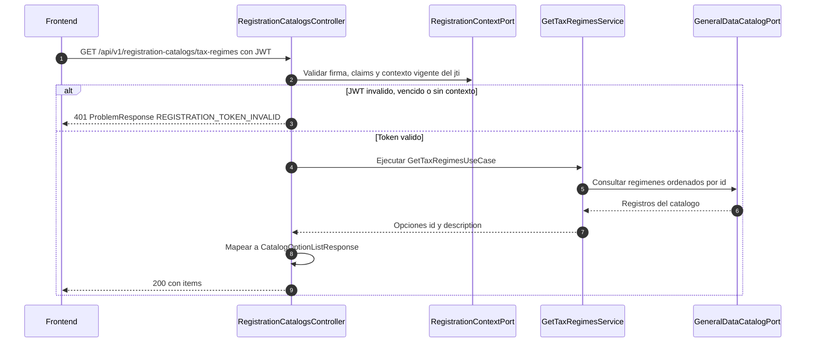
```mermaid
sequenceDiagram
    autonumber
    participant Frontend
    participant Web as RegistrationCatalogsController
    participant Context as RegistrationContextPort
    participant Service as GetTaxRegimesService
    participant Catalogs as GeneralDataCatalogPort

    Frontend->>Web: GET /api/v1/registration-catalogs/tax-regimes con JWT
    Web->>Context: Validar firma, claims y contexto vigente del jti
    alt JWT invalido, vencido o sin contexto
        Web-->>Frontend: 401 ProblemResponse REGISTRATION_TOKEN_INVALID
    else Token valido
        Web->>Service: Ejecutar GetTaxRegimesUseCase
        Service->>Catalogs: Consultar regimenes ordenados por id
        Catalogs-->>Service: Registros del catalogo
        Service-->>Web: Opciones id y description
        Web->>Web: Mapear a CatalogOptionListResponse
        Web-->>Frontend: 200 con items
    end
```

### 6.2. `getCountries`

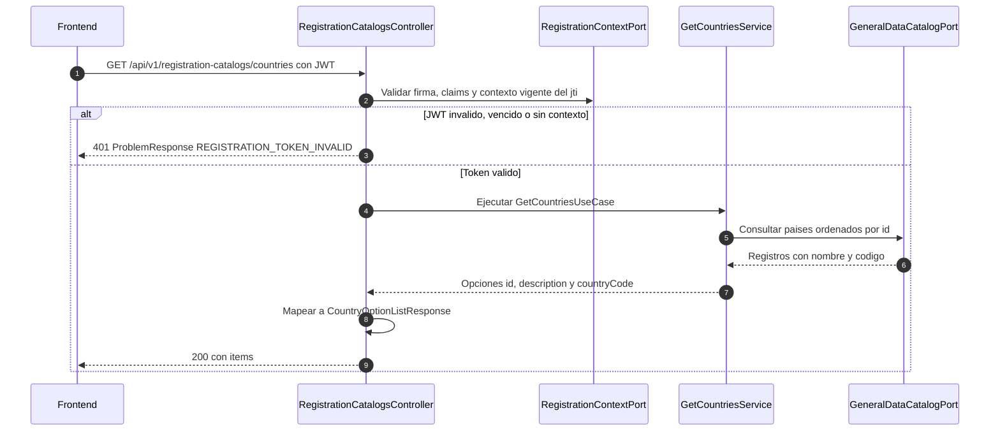
```mermaid
sequenceDiagram
    autonumber
    participant Frontend
    participant Web as RegistrationCatalogsController
    participant Context as RegistrationContextPort
    participant Service as GetCountriesService
    participant Catalogs as GeneralDataCatalogPort

    Frontend->>Web: GET /api/v1/registration-catalogs/countries con JWT
    Web->>Context: Validar firma, claims y contexto vigente del jti
    alt JWT invalido, vencido o sin contexto
        Web-->>Frontend: 401 ProblemResponse REGISTRATION_TOKEN_INVALID
    else Token valido
        Web->>Service: Ejecutar GetCountriesUseCase
        Service->>Catalogs: Consultar paises ordenados por id
        Catalogs-->>Service: Registros con nombre y codigo
        Service-->>Web: Opciones id, description y countryCode
        Web->>Web: Mapear a CountryOptionListResponse
        Web-->>Frontend: 200 con items
    end
```

### 6.3. `getLegalOwnerships`

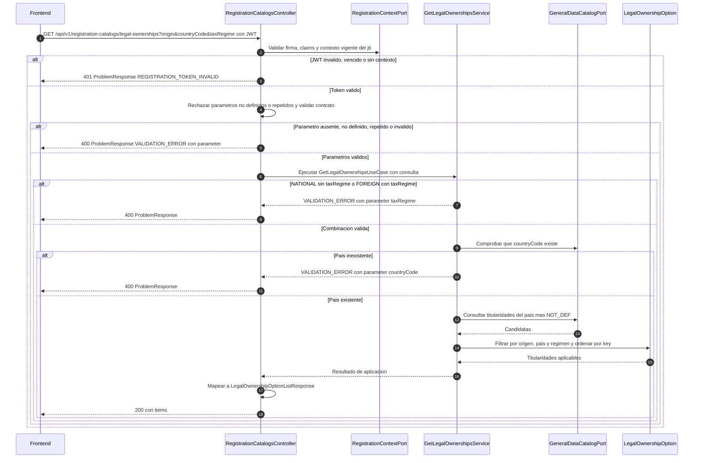
```mermaid
sequenceDiagram
    autonumber
    participant Frontend
    participant Web as RegistrationCatalogsController
    participant Context as RegistrationContextPort
    participant Service as GetLegalOwnershipsService
    participant Catalogs as GeneralDataCatalogPort
    participant Options as LegalOwnershipOption

    Frontend->>Web: GET /api/v1/registration-catalogs/legal-ownerships?origin&countryCode&taxRegime con JWT
    Web->>Context: Validar firma, claims y contexto vigente del jti
    alt JWT invalido, vencido o sin contexto
        Web-->>Frontend: 401 ProblemResponse REGISTRATION_TOKEN_INVALID
    else Token valido
        Web->>Web: Rechazar parametros no definidos o repetidos y validar contrato
        alt Parametro ausente, no definido, repetido o invalido
            Web-->>Frontend: 400 ProblemResponse VALIDATION_ERROR con parameter
        else Parametros validos
            Web->>Service: Ejecutar GetLegalOwnershipsUseCase con consulta
            alt NATIONAL sin taxRegime o FOREIGN con taxRegime
                Service-->>Web: VALIDATION_ERROR con parameter taxRegime
                Web-->>Frontend: 400 ProblemResponse
            else Combinacion valida
                Service->>Catalogs: Comprobar que countryCode existe
                alt Pais inexistente
                    Service-->>Web: VALIDATION_ERROR con parameter countryCode
                    Web-->>Frontend: 400 ProblemResponse
                else Pais existente
                    Service->>Catalogs: Consultar titularidades del pais mas NOT_DEF
                    Catalogs-->>Service: Candidatas
                    Service->>Options: Filtrar por origen, pais y regimen y ordenar por key
                    Options-->>Service: Titularidades aplicables
                    Service-->>Web: Resultado de aplicacion
                    Web->>Web: Mapear a LegalOwnershipOptionListResponse
                    Web-->>Frontend: 200 con items
                end
            end
        end
    end
```

### 6.4. `getSectors`

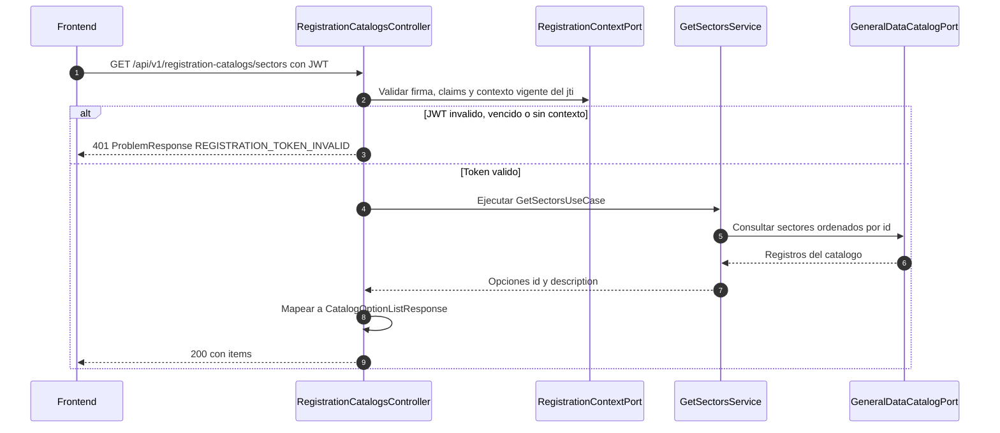
```mermaid
sequenceDiagram
    autonumber
    participant Frontend
    participant Web as RegistrationCatalogsController
    participant Context as RegistrationContextPort
    participant Service as GetSectorsService
    participant Catalogs as GeneralDataCatalogPort

    Frontend->>Web: GET /api/v1/registration-catalogs/sectors con JWT
    Web->>Context: Validar firma, claims y contexto vigente del jti
    alt JWT invalido, vencido o sin contexto
        Web-->>Frontend: 401 ProblemResponse REGISTRATION_TOKEN_INVALID
    else Token valido
        Web->>Service: Ejecutar GetSectorsUseCase
        Service->>Catalogs: Consultar sectores ordenados por id
        Catalogs-->>Service: Registros del catalogo
        Service-->>Web: Opciones id y description
        Web->>Web: Mapear a CatalogOptionListResponse
        Web-->>Frontend: 200 con items
    end
```

### 6.5. `getSubsectors`

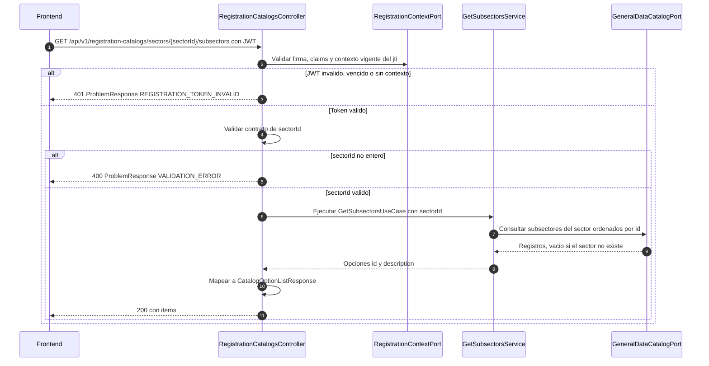
```mermaid
sequenceDiagram
    autonumber
    participant Frontend
    participant Web as RegistrationCatalogsController
    participant Context as RegistrationContextPort
    participant Service as GetSubsectorsService
    participant Catalogs as GeneralDataCatalogPort

    Frontend->>Web: GET /api/v1/registration-catalogs/sectors/{sectorId}/subsectors con JWT
    Web->>Context: Validar firma, claims y contexto vigente del jti
    alt JWT invalido, vencido o sin contexto
        Web-->>Frontend: 401 ProblemResponse REGISTRATION_TOKEN_INVALID
    else Token valido
        Web->>Web: Validar contrato de sectorId
        alt sectorId no entero
            Web-->>Frontend: 400 ProblemResponse VALIDATION_ERROR
        else sectorId valido
            Web->>Service: Ejecutar GetSubsectorsUseCase con sectorId
            Service->>Catalogs: Consultar subsectores del sector ordenados por id
            Catalogs-->>Service: Registros, vacio si el sector no existe
            Service-->>Web: Opciones id y description
            Web->>Web: Mapear a CatalogOptionListResponse
            Web-->>Frontend: 200 con items
        end
    end
```

### 6.6. `getBusinessActivities`

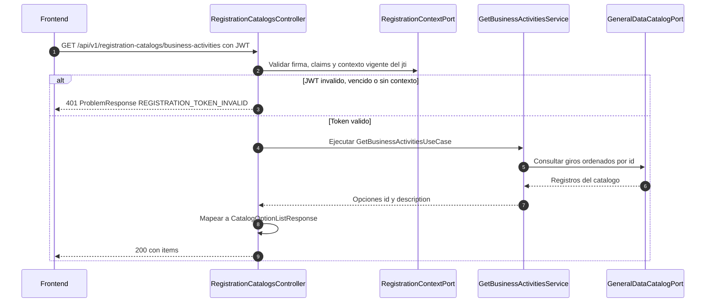
```mermaid
sequenceDiagram
    autonumber
    participant Frontend
    participant Web as RegistrationCatalogsController
    participant Context as RegistrationContextPort
    participant Service as GetBusinessActivitiesService
    participant Catalogs as GeneralDataCatalogPort

    Frontend->>Web: GET /api/v1/registration-catalogs/business-activities con JWT
    Web->>Context: Validar firma, claims y contexto vigente del jti
    alt JWT invalido, vencido o sin contexto
        Web-->>Frontend: 401 ProblemResponse REGISTRATION_TOKEN_INVALID
    else Token valido
        Web->>Service: Ejecutar GetBusinessActivitiesUseCase
        Service->>Catalogs: Consultar giros ordenados por id
        Catalogs-->>Service: Registros del catalogo
        Service-->>Web: Opciones id y description
        Web->>Web: Mapear a CatalogOptionListResponse
        Web-->>Frontend: 200 con items
    end
```

### 6.7. `getStratifications`

```mermaid
sequenceDiagram
    autonumber
    participant Frontend
    participant Web as RegistrationCatalogsController
    participant Context as RegistrationContextPort
    participant Service as GetStratificationsService
    participant Catalogs as GeneralDataCatalogPort

    Frontend->>Web: GET /api/v1/registration-catalogs/stratifications con JWT
    Web->>Context: Validar firma, claims y contexto vigente del jti
    alt JWT invalido, vencido o sin contexto
        Web-->>Frontend: 401 ProblemResponse REGISTRATION_TOKEN_INVALID
    else Token valido
        Web->>Service: Ejecutar GetStratificationsUseCase
        Service->>Catalogs: Consultar estratificaciones activas ordenadas por id, sin filtro de regimen
        Catalogs-->>Service: Registros activos
        Service-->>Web: Opciones id y description
        Web->>Web: Mapear a CatalogOptionListResponse
        Web-->>Frontend: 200 con items
    end
```

### 6.8. `getPrimaryActivities`

```mermaid
sequenceDiagram
    autonumber
    participant Frontend
    participant Web as RegistrationCatalogsController
    participant Context as RegistrationContextPort
    participant Service as GetPrimaryActivitiesService
    participant Catalogs as GeneralDataCatalogPort

    Frontend->>Web: GET /api/v1/registration-catalogs/primary-activities con JWT
    Web->>Context: Validar firma, claims y contexto vigente del jti
    alt JWT invalido, vencido o sin contexto
        Web-->>Frontend: 401 ProblemResponse REGISTRATION_TOKEN_INVALID
    else Token valido
        Web->>Service: Ejecutar GetPrimaryActivitiesUseCase
        Service->>Catalogs: Consultar actividades preponderantes ordenadas por id
        Catalogs-->>Service: Registros del catalogo
        Service-->>Web: Opciones id y description
        Web->>Web: Mapear a CatalogOptionListResponse
        Web-->>Frontend: 200 con items
    end
```

### 6.9. `getWorkerCountRanges`

```mermaid
sequenceDiagram
    autonumber
    participant Frontend
    participant Web as RegistrationCatalogsController
    participant Context as RegistrationContextPort
    participant Service as GetWorkerCountRangesService
    participant Catalogs as GeneralDataCatalogPort

    Frontend->>Web: GET /api/v1/registration-catalogs/worker-count-ranges con JWT
    Web->>Context: Validar firma, claims y contexto vigente del jti
    alt JWT invalido, vencido o sin contexto
        Web-->>Frontend: 401 ProblemResponse REGISTRATION_TOKEN_INVALID
    else Token valido
        Web->>Service: Ejecutar GetWorkerCountRangesUseCase
        Service->>Catalogs: Consultar rangos de trabajadores ordenados por id
        Catalogs-->>Service: Registros del catalogo
        Service-->>Web: Opciones id y description
        Web->>Web: Mapear a CatalogOptionListResponse
        Web-->>Frontend: 200 con items
    end
```

### 6.10. `getAnnualSalesRanges`

```mermaid
sequenceDiagram
    autonumber
    participant Frontend
    participant Web as RegistrationCatalogsController
    participant Context as RegistrationContextPort
    participant Service as GetAnnualSalesRangesService
    participant Catalogs as GeneralDataCatalogPort

    Frontend->>Web: GET /api/v1/registration-catalogs/annual-sales-ranges con JWT
    Web->>Context: Validar firma, claims y contexto vigente del jti
    alt JWT invalido, vencido o sin contexto
        Web-->>Frontend: 401 ProblemResponse REGISTRATION_TOKEN_INVALID
    else Token valido
        Web->>Service: Ejecutar GetAnnualSalesRangesUseCase
        Service->>Catalogs: Consultar rangos de ventas anuales ordenados por id
        Catalogs-->>Service: Registros del catalogo
        Service-->>Web: Opciones id y description
        Web->>Web: Mapear a CatalogOptionListResponse
        Web-->>Frontend: 200 con items
    end
```

### 6.11. `getCucopCatalog`

```mermaid
sequenceDiagram
    autonumber
    participant Frontend
    participant Web as RegistrationCatalogsController
    participant Context as RegistrationContextPort
    participant Service as GetCucopCatalogService
    participant Catalog as CucopCatalogPort

    Frontend->>Web: GET /api/v1/registration-catalogs/cucop con JWT
    Web->>Context: Validar firma, claims y contexto vigente del jti
    alt JWT invalido, vencido o sin contexto
        Web-->>Frontend: 401 ProblemResponse REGISTRATION_TOKEN_INVALID
    else Token valido
        Web->>Service: Ejecutar GetCucopCatalogUseCase
        Service->>Catalog: Consultar los cuatro niveles en una sola consulta
        Catalog-->>Service: Capitulos, conceptos, genericas y especificas
        Service->>Service: Jerarquizar por ID de padre y ordenar hermanos por key
        Service-->>Web: Arbol de nodos
        Web->>Web: Mapear a CucopCatalogResponse
        Web-->>Frontend: 200 con items de capitulos y sus hijos
    end
```
